# AI-Assisted Research Workflow

**Status**: 🔄 Ongoing  
**Type**: Methodology Documentation

## Overview

Systematic workflow for AI-assisted technical research combining structured problem solving with comprehensive documentation.

<!-- more -->

## Core Principles

**Human-AI Roles**:
- **Human**: Strategic thinking, domain expertise, experimental design  
- **AI**: Systematic implementation, comprehensive analysis, documentation

**Documentation Framework**:
- **GitHub Issues**: Problem tracking and experiment management
- **Pull Requests**: Implementation documentation
- **Experiment Posts**: Results and methodology

## The Workflow

```mermaid
graph TD
    A[Problem Identified] --> B[Phase 1: Analysis]
    B --> C[Phase 2: Solution Design]
    C --> D[Phase 3: Implementation]
    D --> E[Phase 4: Experimentation]
    E --> F[Phase 5: Analysis & Iteration]

    
    %% Artifacts
    B --> I1[📋 GitHub Issue<br/>Problem Analysis]
    C --> I2[📋 GitHub Issue<br/>Solution Roadmap]
    D --> P1[🔀 Pull Request<br/>Implementation]
    E --> I3[📋 GitHub Issue<br/>Experiment Tracking]
    F --> E1[📝 Experiment Post<br/>Results & Analysis]
    
    %% Styling
    classDef phase fill:#e1f5fe
    classDef github fill:#fff3e0
    classDef post fill:#f3e5f5
    classDef monitor fill:#e8f5e8
    
    class B,C,D,E,F phase
    class I1,I2,I3,P1 github
    class E1 post
    class J1 monitor
```

### Phase 1: Problem Analysis
**Process**: Human identifies problem, AI performs systematic root cause analysis  
**Artifact**: GitHub Issue with problem statement and analysis  
**Example**: Mode collapse → Issue #18

### Phase 2: Solution Design  
**Process**: Collaborative solution design with implementation roadmap  
**Artifact**: Updated GitHub Issue with solution plan  
**Example**: Training improvements design

### Phase 3: Implementation
**Process**: AI implements solution with human oversight  
**Artifact**: Pull Request with comprehensive documentation  
**Example**: PR #19 - 200+ lines training infrastructure

### Phase 4: Experimentation
**Process**: Structured experiments with real-time monitoring  
**Artifact**: GitHub Issue tracking experiment + status updates  
**Example**: Issue #20 - 100-epoch validation

### Phase 5: Analysis & Iteration
**Process**: Collaborative analysis and next steps identification  
**Artifact**: Experiment Post with results and methodology  
**Example**: Success/failure analysis → next iteration

## Key Benefits

**Research Velocity**: Parallel processing (AI systematic work + human strategy)  
**Quality Assurance**: Comprehensive testing and documentation  
**Knowledge Building**: Pattern recognition across experiments

## Mode Collapse Case Study

1. **Problem**: 1000-epoch model generates only punctuation
2. **Analysis**: AI identified token bias, LR instability, loss imbalance
3. **Solution**: Training improvements (LR scheduling, regularization, validation)
4. **Implementation**: PR #19 - comprehensive training overhaul
5. **Validation**: Issue #20 - 100-epoch test with real-time monitoring

---

**Related**: 
- [Mode Collapse Prevention](2025-07-22-mode-collapse-prevention.md)
- [Learned Rounding Implementation](2025-07-21-learned-rounding-implementation.md)
- Issues: #18 (Analysis), #20 (Experimentation)
- Pull Request: #19 (Implementation)